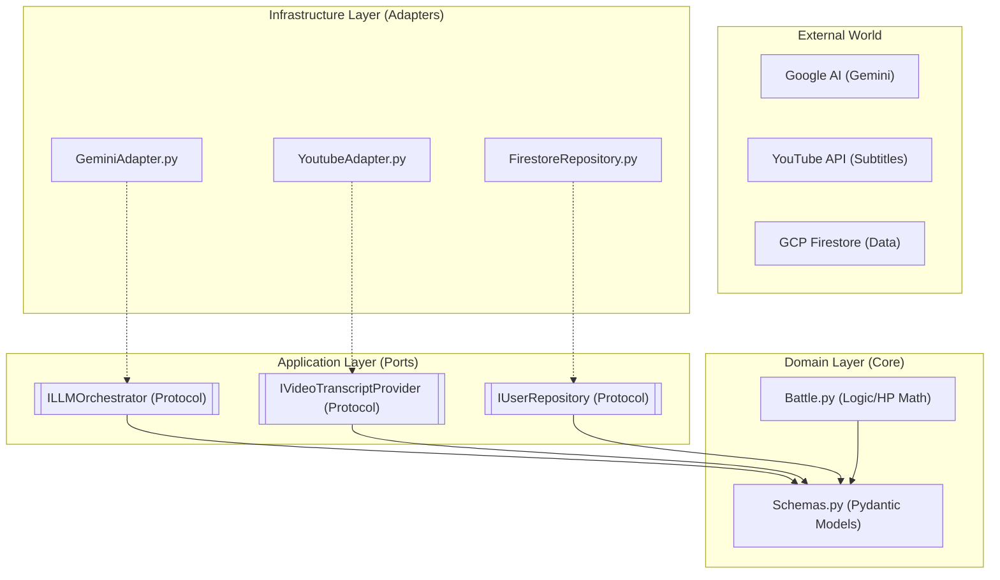
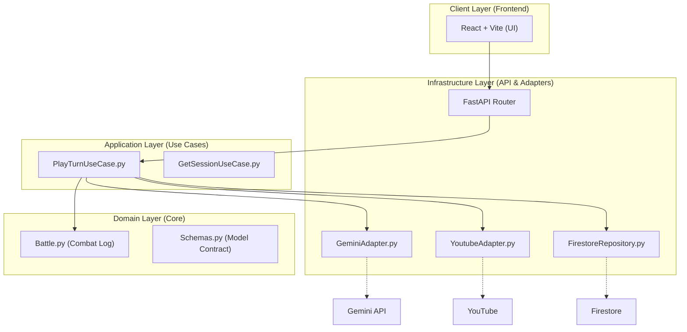

# Project Architecture: Current vs. Final State

Here is the breakdown of the project's structure, focusing on the **Hexagonal Architecture** (Ports and Adapters).

## 1. Current Architecture (Hexagonal Focus)
This diagram shows how the Core Domain is isolated and interacts with external services via Ports and Adapters.

## 2. Final E2E Target Architecture
The complete flow from the React frontend to the storage layer through the orchestration use cases.

## 🏗️ Key Principles Applied
- **Dependency Rule:** All dependencies point inwards. The **Domain** knows nothing about FastAPI, Firestore, or Gemini.
- **Isolation:** If we want to change from Gemini to GPT-4, we only replace one adapter (`GeminiAdapter.py`).
- **Testability:** We can test the entire **Application Layer** using mocks for the ports, exactly as I did in the Firestore tests.

---
**Current Progress:** We are finishing the **Infrastructure & Ports** (Gray/Blue boxes).
**Next Step:** Building the **Application Layer** (Green boxes) to drive the game logic.
